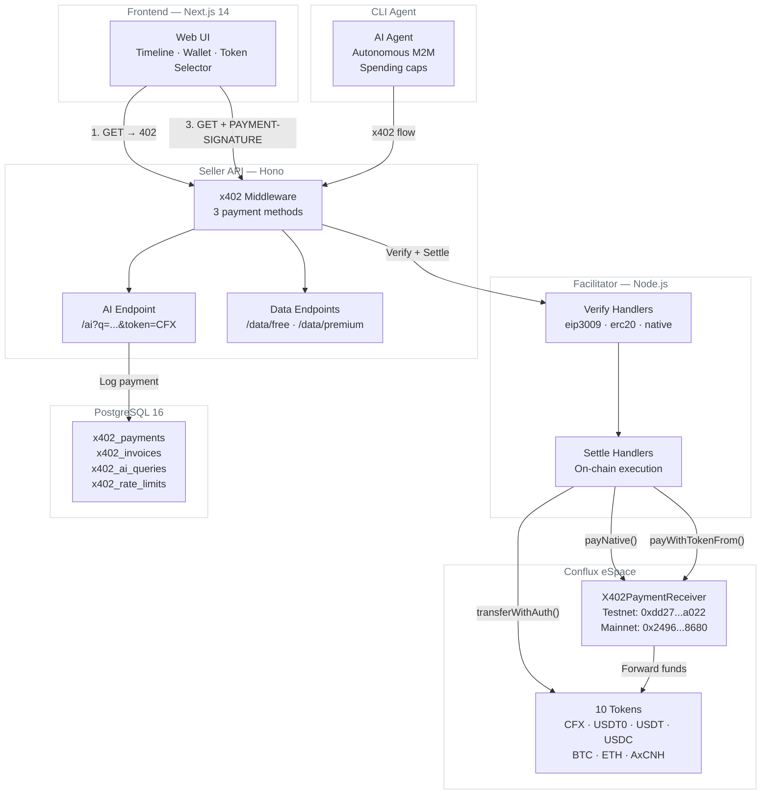
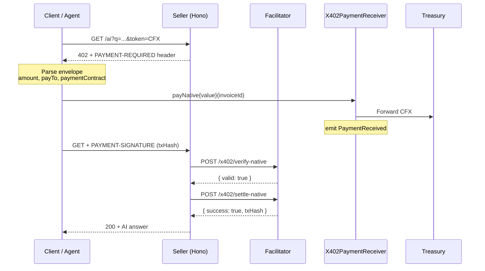
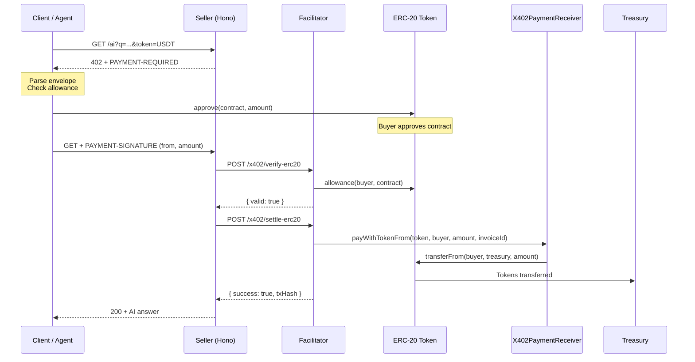
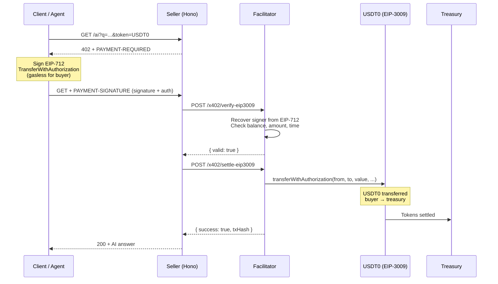
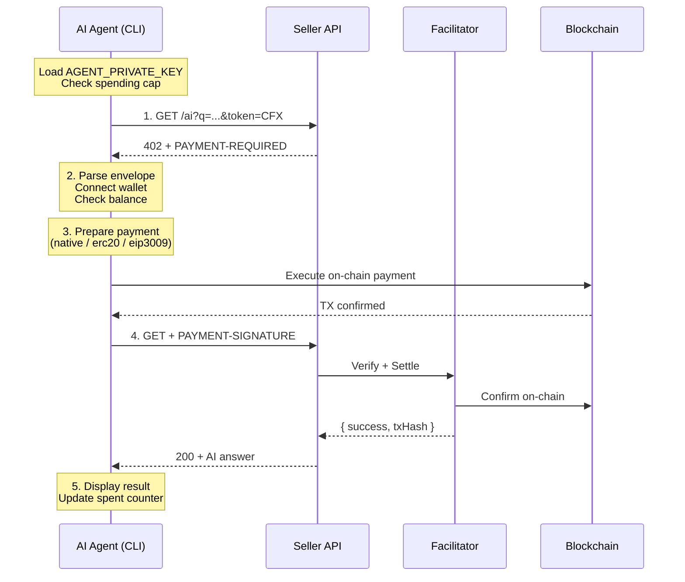

# x402 Fullstack — Conflux eSpace

> End-to-end **x402 (HTTP 402 Payment Required)** implementation on Conflux eSpace — seller API, facilitator, smart contract, web UI, and AI agent with **10 tokens**, **3 payment methods**, and **dual-network** support (Testnet + Mainnet)

[](https://github.com/confluxarena/x402-fullstack/actions/workflows/ci.yml)
[](LICENSE)
[](https://confluxarena.org/x402-app)
[](https://nodejs.org/)
[](https://www.typescriptlang.org/)
[](https://soliditylang.org/)
[](https://www.postgresql.org/)
[](https://confluxnetwork.org/)
[](https://www.x402.org)
[](https://www.x402scan.com/server/10e92a74-5040-4b72-818d-71044d022b72)

---

## Table of Contents

- [Overview](#overview)
- [Architecture](#architecture)
- [x402 Protocol Flow](#x402-protocol-flow)
- [Payment Methods](#payment-methods)
- [Supported Tokens](#supported-tokens)
- [Quick Start](#quick-start)
- [Smart Contract](#smart-contract)
- [AI Agent](#ai-agent)
- [API Reference](#api-reference)
- [Environment Variables](#environment-variables)
- [Security](#security)
- [Key Standards](#key-standards)
- [License](#license)

---

## Overview

| Component | Technology | Description |
|-----------|-----------|-------------|
| **Seller API** | Hono + TypeScript | x402 middleware, paid AI endpoint, free/premium data |
| **Facilitator** | TypeScript + ethers.js 6 | Verifies payments & settles on-chain (native, ERC-20, EIP-3009) |
| **Smart Contract** | Solidity 0.8.24 + Hardhat | Universal payment receiver — deployed on Testnet & Mainnet |
| **Web Frontend** | Next.js 14 + Tailwind CSS | Timeline UI, multi-wallet modal (MetaMask, Fluent, OKX), network/token selector |
| **AI Agent** | TypeScript CLI | Autonomous 5-step payment flow with spending caps |
| **Database** | PostgreSQL 16 | Payment logs, invoices, rate limits, AI queries |

---

## Architecture



### Project Structure

```
x402-fullstack/
├── seller/                    # Hono API server
│   └── src/
│       ├── config/            # networks.ts, database.ts, env.ts
│       ├── routes/            # ai.ts, data.ts, health.ts, payments.ts
│       ├── services/          # payments.ts (logging, history, stats)
│       ├── middleware/         # x402.ts, rateLimiter.ts
│       ├── types.ts           # Typed Hono context (X402Env)
│       └── index.ts           # Server entry
├── facilitator/               # Payment settlement service
│   └── src/
│       ├── handlers/          # eip3009.ts, erc20.ts, native.ts
│       ├── config.ts          # ABIs, environment
│       └── index.ts           # HTTP server
├── frontend/                  # Next.js 14 + Tailwind
│   └── src/
│       ├── app/               # Pages: demo, history, admin, pay
│       └── lib/               # x402 client, wallet, networks
├── agent/                     # Autonomous CLI agent
│   └── src/index.ts           # 5-step payment flow
├── contracts/                 # Solidity + Hardhat
│   ├── contracts/             # X402PaymentReceiver.sol
│   ├── test/                  # Hardhat tests
│   └── scripts/deploy.ts      # Deploy script
├── database/schema.sql        # PostgreSQL 16 (4 tables)
├── .well-known/x402           # Discovery document
├── docker-compose.yml         # Full stack (4 services)
├── .github/workflows/ci.yml   # CI pipeline (6 jobs)
└── .env.example
```

---

## x402 Protocol Flow

### Native CFX Payment

Buyer sends CFX to the payment contract — facilitator verifies the TX receipt.



### ERC-20 Payment (approve + transferFrom)

Buyer approves the contract, then the facilitator (relayer) calls `payWithTokenFrom` on behalf of the buyer.



### EIP-3009 Payment (Gasless)

Buyer signs an off-chain EIP-712 message — the facilitator settles on-chain via `transferWithAuthorization`. **Zero gas for the buyer.**



### AI Agent Flow (CLI)

Autonomous 5-step machine-to-machine payment — no UI, no wallet, just a private key.



---

## Payment Methods

| Method | How It Works | Gas Cost (Buyer) | Tokens |
|--------|-------------|------------------|--------|
| **Native** | CFX sent to `payNative()` on payment contract | Buyer pays gas | CFX |
| **ERC-20** | `approve()` + relayer calls `payWithTokenFrom()` | Buyer pays approve gas | USDT, USDC, BTC, ETH, AxCNH |
| **EIP-3009** | Off-chain EIP-712 signature → `transferWithAuthorization()` | **Zero gas** (relayer pays) | USDT0 |

---

## Supported Tokens

### Testnet (Chain 71)

| Token | Address | Decimals | Method |
|-------|---------|----------|--------|
| CFX | Native | 18 | native |
| USDT | [`0x7d682e65EFC5C13Bf4E394B8f376C48e6baE0355`](https://evmtestnet.confluxscan.org/token/0x7d682e65EFC5C13Bf4E394B8f376C48e6baE0355) | 18 | erc20 |
| USDC | [`0x349298b0e20df67defd6efb8f3170cf4a32722ef`](https://evmtestnet.confluxscan.org/token/0x349298b0e20df67defd6efb8f3170cf4a32722ef) | 18 | erc20 |
| BTC | [`0x54593e02c39aeff52b166bd036797d2b1478de8d`](https://evmtestnet.confluxscan.org/token/0x54593e02c39aeff52b166bd036797d2b1478de8d) | 18 | erc20 |
| ETH | [`0xcd71270f82f319e0498ff98af8269c3f0d547c65`](https://evmtestnet.confluxscan.org/token/0xcd71270f82f319e0498ff98af8269c3f0d547c65) | 18 | erc20 |

### Mainnet (Chain 1030)

| Token | Address | Decimals | Method |
|-------|---------|----------|--------|
| CFX | Native | 18 | native |
| USDT0 | [`0xaf37e8b6c9ed7f6318979f56fc287d76c30847ff`](https://evm.confluxscan.io/token/0xaf37e8b6c9ed7f6318979f56fc287d76c30847ff) | 6 | eip3009 |
| USDT | [`0xfe97e85d13abd9c1c33384e796f10b73905637ce`](https://evm.confluxscan.io/token/0xfe97e85d13abd9c1c33384e796f10b73905637ce) | 18 | erc20 |
| USDC | [`0x6963efed0ab40f6c3d7bda44a05dcf1437c44372`](https://evm.confluxscan.io/token/0x6963efed0ab40f6c3d7bda44a05dcf1437c44372) | 18 | erc20 |
| AxCNH | [`0x70bfd7f7eadf9b9827541272589a6b2bb760ae2e`](https://evm.confluxscan.io/token/0x70bfd7f7eadf9b9827541272589a6b2bb760ae2e) | 6 | erc20 |

---

## Quick Start

### Prerequisites

- Node.js 20+
- PostgreSQL 16
- Docker & Docker Compose (optional)

### 1. Clone & Configure

```bash
git clone https://github.com/confluxarena/x402-fullstack.git
cd x402-fullstack
cp .env.example .env
# Edit .env with your keys
```

### 2. Docker Compose (recommended)

```bash
docker compose up -d
# Open http://localhost:3000
```

This starts:
- **PostgreSQL 16** on port 5432 (auto-runs `database/schema.sql`)
- **Facilitator** on port 3851
- **Seller API** on port 3852
- **Frontend** on port 3000

### 3. Manual Setup

```bash
# Database
psql -U x402 -d x402 -f database/schema.sql

# Facilitator
cd facilitator && npm install && npm run dev

# Seller (new terminal)
cd seller && npm install && npm run dev

# Frontend (new terminal)
cd frontend && npm install && npm run dev

# Open http://localhost:3000
```

### 4. Deploy Smart Contract

```bash
cd contracts
npm install
npx hardhat compile
npx hardhat run scripts/deploy.ts --network conflux-testnet
# Copy the deployed address to .env → PAYMENT_CONTRACT_TESTNET
```

### 5. Run Tests

```bash
# Contract tests
cd contracts && npx hardhat test

# Type-check all packages
cd seller && npx tsc --noEmit
cd facilitator && npx tsc --noEmit
cd agent && npx tsc --noEmit
cd frontend && npx tsc --noEmit
```

---

## Smart Contract

**`X402PaymentReceiver.sol`** — Universal payment receiver deployed on both networks.

| Network | Address | Explorer |
|---------|---------|----------|
| Testnet (71) | `0xdd27b28203E12f90b8450d2C538e0Bb381A4a022` | [ConfluxScan](https://evmtestnet.confluxscan.org/address/0xdd27b28203E12f90b8450d2C538e0Bb381A4a022) |
| Mainnet (1030) | `0x2496C17Ee9BDEcc32e14b125122f92792e18b680` | [ConfluxScan](https://evm.confluxscan.io/address/0x2496C17Ee9BDEcc32e14b125122f92792e18b680) |

### Functions

| Function | Caller | Description |
|----------|--------|-------------|
| `payNative(invoiceId)` | Buyer | Accept CFX, forward to treasury |
| `payWithToken(token, amount, invoiceId)` | Buyer | Accept ERC-20 (buyer calls directly) |
| `payWithTokenFrom(token, from, amount, invoiceId)` | Relayer (owner) | Accept ERC-20 on behalf of buyer |
| `payWithAuthorization(token, from, amount, ...)` | Relayer (owner) | Accept EIP-3009 gasless transfer |
| `setTreasury(address)` | Owner | Update treasury address |
| `rescueTokens(token, amount)` | Owner | Rescue stuck tokens/CFX |

### Events

```solidity
event PaymentReceived(
    bytes32 indexed invoiceId,
    address indexed payer,
    address token,         // address(0) for native CFX
    uint256 amount,
    string paymentMethod   // "native", "erc20", "eip3009"
);
```

---

## AI Agent

Autonomous CLI agent that detects HTTP 402 responses and executes payments without human interaction.

### Usage

```bash
cd agent && npm install

# Default token (CFX on testnet)
AGENT_PRIVATE_KEY=0x... npx tsx src/index.ts "What is Conflux?"

# Specify token
AGENT_PRIVATE_KEY=0x... npx tsx src/index.ts --token USDT "What is DeFi?"

# Custom API URL and spending cap
AGENT_API_URL=https://example.com/x402-api \
AGENT_SPEND_CAP=0.5 \
AGENT_PRIVATE_KEY=0x... npx tsx src/index.ts "Explain x402"
```

### Features

- **3 payment methods**: Automatically selects native/erc20/eip3009 based on the 402 envelope
- **Spending cap**: Configurable via `AGENT_SPEND_CAP` (defaults to 1.0 token units)
- **Balance check**: Verifies sufficient balance before attempting payment
- **Colored output**: Step-by-step progress with HTTP badges
- **Explorer links**: Direct ConfluxScan links for every transaction

### Agent Flow

```
┌─────────────────────────────────────────────────────────────────┐
│  STEP 1/5  🌐  Request API                                      │
│  GET /ai?q=What+is+Conflux&token=CFX                           │
│  HTTP 402 — Payment Required                                     │
│  Token: CFX (native)  Price: 0.001 CFX                          │
├─────────────────────────────────────────────────────────────────┤
│  STEP 2/5  💰  Connect wallet                                    │
│  Agent: 0x2E5C...190F    Balance: 999.95 CFX  ✓ Sufficient     │
├─────────────────────────────────────────────────────────────────┤
│  STEP 3/5  ✍️   Prepare native payment                           │
│  Sending CFX to payment contract...                              │
│  TX: 0xa1b2c3d4e5f6...   ✓ Payment prepared                    │
├─────────────────────────────────────────────────────────────────┤
│  STEP 4/5  🚀  Send paid request                                 │
│  HTTP 200 — PAID & SETTLED                                       │
├─────────────────────────────────────────────────────────────────┤
│  STEP 5/5  ✨  Result                                            │
│  Answer: Conflux Network is a high-throughput blockchain...     │
│  Explorer: https://evmtestnet.confluxscan.org/tx/0xa1b2...     │
└─────────────────────────────────────────────────────────────────┘
```

---

## API Reference

### Seller Endpoints

| Method | Path | Auth | Description |
|--------|------|------|-------------|
| GET | `/health` | None | Server status and token list |
| GET | `/tokens` | None | Available tokens for current network |
| GET | `/data/free` | None | Free data endpoint |
| GET | `/data/premium` | x402 | Premium data (paid) |
| GET | `/ai?q=...&token=CFX` | x402 | AI query (paid) |
| GET | `/payments/history` | None | Paginated payment log |
| GET | `/payments/stats` | None | Aggregated revenue and usage |

### Facilitator Endpoints

| Method | Path | Auth | Description |
|--------|------|------|-------------|
| GET | `/x402/health` | None | Facilitator status |
| POST | `/x402/verify-eip3009` | API Key | Verify EIP-3009 signature |
| POST | `/x402/settle-eip3009` | API Key | Settle EIP-3009 transfer |
| POST | `/x402/verify-erc20` | API Key | Verify ERC-20 allowance |
| POST | `/x402/settle-erc20` | API Key | Settle ERC-20 transfer |
| POST | `/x402/verify-native` | API Key | Verify native TX receipt |
| POST | `/x402/settle-native` | API Key | Confirm native TX |

### HTTP 402 Response Headers

| Header | Example | Description |
|--------|---------|-------------|
| `PAYMENT-REQUIRED` | `base64(JSON)` | x402 V2 PaymentRequired envelope |
| `X-Payment-Amount` | `1000000000000000` | Amount in token's smallest unit |
| `X-Payment-Token` | `0x0000...` | Token contract address |
| `X-Payment-Nonce` | `a1b2c3d4...` | Unique request nonce (hex) |
| `X-Payment-Expiry` | `1738700000` | Unix timestamp — payment deadline |
| `X-Payment-Endpoint` | `/ai` | Endpoint path requiring payment |
| `X-Payment-Invoice-Id` | `e5f6a7b8...` | Ephemeral invoice identifier |

### PaymentRequired Envelope (V2)

```json
{
  "x402Version": 2,
  "resource": {
    "url": "/ai",
    "description": "API query — 0.001 CFX per request",
    "mimeType": "application/json"
  },
  "accepts": [{
    "scheme": "exact",
    "network": "eip155:71",
    "amount": "1000000000000000",
    "asset": "0x0000000000000000000000000000000000000000",
    "payTo": "0x2E5C3F27dE0284D46650963c9F09c9C16cD0190F",
    "maxTimeoutSeconds": 3600,
    "extra": {
      "paymentMethod": "native",
      "symbol": "CFX",
      "decimals": 18,
      "paymentContract": "0xdd27b28203E12f90b8450d2C538e0Bb381A4a022"
    }
  }]
}
```

---

## Environment Variables

| Variable | Required | Default | Description |
|----------|----------|---------|-------------|
| `NETWORK` | No | `testnet` | Network: `testnet` or `mainnet` |
| `RELAYER_PRIVATE_KEY` | Yes | — | Wallet key for gas (facilitator) |
| `TREASURY_ADDRESS` | Yes | — | Receives all payments |
| `PAYMENT_CONTRACT_TESTNET` | Yes | `0xdd27...a022` | Contract on testnet |
| `PAYMENT_CONTRACT_MAINNET` | Yes | `0x2496...8680` | Contract on mainnet |
| `FACILITATOR_KEY` | Yes | — | Shared secret (seller ↔ facilitator) |
| `FACILITATOR_HOST` | No | `127.0.0.1` | Facilitator host (`facilitator` for Docker) |
| `FACILITATOR_PORT` | No | `3851` | Facilitator port |
| `SELLER_PORT` | No | `3852` | Seller API port |
| `CLAUDE_API_KEY` | Yes | — | Anthropic API key for AI endpoint |
| `CLAUDE_MODEL` | No | `claude-3-5-haiku` | Claude model ID |
| `DB_HOST` | Yes | `db` | PostgreSQL host |
| `DB_PORT` | No | `5432` | PostgreSQL port |
| `DB_NAME` | Yes | `x402` | Database name |
| `DB_USER` | Yes | `x402` | Database user |
| `DB_PASS` | Yes | — | Database password |
| `AGENT_PRIVATE_KEY` | No | — | Agent wallet private key |
| `AGENT_SPEND_CAP` | No | `1.0` | Max spend per session (token units) |
| `AGENT_API_URL` | No | `http://localhost:3852` | Seller API URL for agent |

---

## Security

| Feature | Implementation |
|---------|---------------|
| **Facilitator isolation** | Binds to `127.0.0.1` — never exposed to internet |
| **API key auth** | Shared secret between seller ↔ facilitator |
| **Replay protection** | One-time nonces (EIP-3009), unique invoice IDs |
| **Payment binding** | Invoice ID + nonce + expiry + endpoint scope |
| **Balance validation** | Checked before settlement (prevents failed TXs) |
| **EIP-712 recovery** | Signer address recovered and verified before settlement |
| **Time windows** | `validBefore`/`validAfter` enforced on all EIP-3009 payments |
| **Agent spending cap** | `AGENT_SPEND_CAP` prevents runaway spending |
| **Rate limiting** | Per-IP sliding window (30 req/min AI, 60 req/min data) |
| **Request body limit** | 1 MB limit on facilitator |
| **CORS** | `Access-Control-Allow-Origin: *` with exposed x402 headers |

---

## Key Standards

| Standard | Purpose |
|----------|---------|
| [x402 V2](https://www.x402.org) | HTTP 402 Payment Required protocol |
| [EIP-3009](https://eips.ethereum.org/EIPS/eip-3009) | `transferWithAuthorization` (gasless for buyer) |
| [EIP-712](https://eips.ethereum.org/EIPS/eip-712) | Typed structured data signing |
| [EIP-6963](https://eips.ethereum.org/EIPS/eip-6963) | Multi Injected Provider Discovery |
| [CAIP-2](https://github.com/ChainAgnostic/CAIPs/blob/main/CAIPs/caip-2.md) | Chain identifiers (eip155:71, eip155:1030) |

---

## Tech Stack

| Component | Technology |
|-----------|-----------|
| Seller API | Hono + TypeScript + Node.js 20 |
| Facilitator | TypeScript + ethers.js 6 |
| Frontend | Next.js 14 + Tailwind CSS |
| Agent | TypeScript CLI + ethers.js 6 |
| Database | PostgreSQL 16 |
| Smart Contract | Solidity 0.8.24 + Hardhat |
| Blockchain | Conflux eSpace (Testnet 71 + Mainnet 1030) |
| CI/CD | GitHub Actions (6 jobs) |
| Deploy | Docker Compose |

---

## License

MIT — See [LICENSE](LICENSE) for details.

---

Built for the [x402 Bounty #11](https://github.com/conflux-fans/conflux-bounties/issues/17) on Conflux eSpace.
